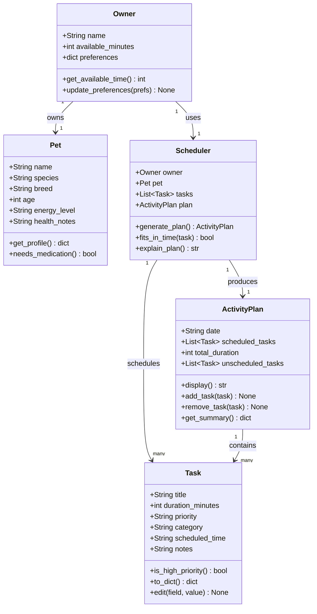
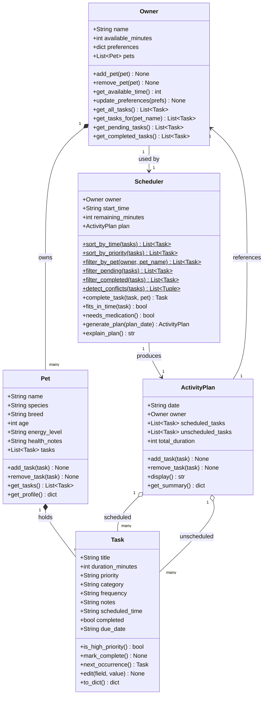

# PawPal+ Project Reflection

## 1. System Design

**a. Initial design**

The initial design uses five classes organized around a clear separation of data and logic. Data about the people and tasks lives in `Owner`, `Pet`, and `Task`. The scheduling logic lives entirely in `Scheduler`. The output of that logic is captured in `ActivityPlan`.

- **`Owner`** — holds the human side of the system: the owner's name, how much time they have available in a day, and any personal preferences (e.g., prefers morning walks). It is the entry point for all user-provided constraints.

- **`Pet`** — holds the animal's profile: name, species, breed, age, energy level, and health notes. This information informs which tasks are appropriate and how urgently they need to happen.

- **`Task`** — represents a single care action (e.g., "Morning walk", "Administer medication"). Each task knows its own duration, priority level, category, and any relevant notes. It also holds a `scheduled_time` once the planner assigns it a slot.

- **`Scheduler`** — the brain of the system. It takes an `Owner`, a `Pet`, and a list of `Task` objects, then decides which tasks to include in the day's plan and in what order, based on available time and priority. It also produces a plain-language explanation of its decisions.

- **`ActivityPlan`** — the output object. It holds the final ordered list of scheduled tasks, a list of tasks that didn't fit, the total time used, and methods to display or summarize the plan. It can also accept manual additions or removals after generation.

**Core User Actions**

The three core actions a user can perform in PawPal+:

1. **Enter pet and owner information** — The user provides details about their pet (species, breed, age, energy level, health needs) and themselves (name, contact info, availability preferences). This data forms the foundation for all scheduling decisions.

2. **Generate an activity plan** — Based on the user's available time, task priorities, and owner preferences, the system automatically creates a personalized activity schedule for the pet. The scheduler balances constraints like duration, frequency, and priority to produce a realistic, optimized plan.

3. **Add or edit tasks** — The user can manually add new tasks (e.g., a vet appointment, a grooming session) or edit existing ones in the activity plan, giving them direct control to adjust, reprioritize, or customize what the scheduler produces.

**UML Class Diagram (initial draft)**



**UML Class Diagram (final — matches implemented code)**



**b. Design changes**

Yes, two changes were made after reviewing the skeleton against the UML.

**Change 1: Moved `needs_medication()` from `Pet` to `Scheduler`**

In the original UML, `needs_medication()` was a method on `Pet`. During review it became clear that `Pet` holds no task data — it only knows the animal's profile (species, age, energy level, etc.). A method that checks whether any tasks are medical in nature has to look at the task list, which only `Scheduler` has access to. Placing the method on `Pet` would have required either giving `Pet` a copy of the tasks (creating unwanted coupling) or leaving it impossible to implement. Moving it to `Scheduler` keeps `Pet` as a pure data object and puts the logic where the data already lives.

**Change 2: Added `remaining_minutes` to `Scheduler`**

The original `Scheduler` had no way to track how much time had been consumed as tasks were added to the plan. `fits_in_time(task)` needs this value to decide whether a task can still be scheduled, but there was nowhere to read it from. `remaining_minutes` is initialized from `owner.available_minutes` in `__init__` and will be decremented inside `generate_plan()` each time a task is accepted. Without this, the scheduler would have no memory of what it had already committed to.

---

## 2. Scheduling Logic and Tradeoffs

**a. Constraints and priorities**

The scheduler considers three constraints: **available time** (the owner's daily minute budget), **task priority** (high / medium / low), and **task duration** (how long each task takes). Owner preferences are stored but not yet used as a scheduling constraint — they are available for a future enhancement such as preferring morning exercise tasks.

Priority was weighted most heavily because it directly reflects real-world urgency. Missing a medication dose is more serious than skipping a grooming session. Duration was made a secondary constraint within the same priority tier: among equally urgent tasks, scheduling shorter ones first maximizes the number of tasks that fit in the available window. Available time is the hard ceiling — no task can be accepted once it would exceed the remaining budget.

**b. Tradeoffs**

The scheduler uses a **greedy algorithm**: it iterates through tasks sorted by priority (and by shortest duration within the same priority tier) and accepts each task as long as it fits in the remaining time budget. Once accepted, a task is never reconsidered — there is no backtracking.

This means the scheduler can produce a suboptimal packing. For example, if a 25-minute "high" task fills the last slot and a 5-minute "high" task is next in line, the 5-minute task gets skipped — even though it would fit if the 25-minute task had been deferred. A true optimal solution would require evaluating all possible combinations (a knapsack-style approach), which grows exponentially with the number of tasks.

The greedy approach is a reasonable tradeoff here for two reasons. First, pet care tasks are not interchangeable commodities — "high" priority tasks like medication or feeding genuinely should be attempted before "low" priority ones, so strict priority ordering reflects real-world intent. Second, the task list for a typical pet owner is small (5–20 tasks), so the edge cases where greedy fails (large tasks blocking small ones of equal priority) can be handled manually by the owner using the add/edit UI rather than requiring the complexity of full combinatorial optimization.

---

## 3. AI Collaboration

**a. How you used AI**

AI tools were used at every phase of the project, but the role shifted as the work progressed.

During **design**, AI was most useful for brainstorming — generating an initial list of classes and methods, proposing relationships between them, and flagging potential bottlenecks in the skeleton before any logic was written. Prompts that were most effective were specific and structural: *"Based on this UML, what relationships are missing?"* or *"Which class should own the task list, and why?"* Open-ended prompts like *"design a pet scheduler"* produced generic answers that required heavy editing.

During **implementation**, AI was used to generate method bodies from docstrings and to suggest algorithmic improvements (the two-key sort lambda, the `"99:99"` sentinel, the greedy scheduler pattern). The most productive prompts included the exact context: sharing the current skeleton and asking *"how should `fits_in_time` know how much time is left?"* rather than asking abstractly about schedulers.

During **testing**, AI generated test scaffolding quickly — helper fixtures, assertion patterns, and edge-case suggestions. The most useful prompt format was: *"Given this method signature and docstring, what are the happy paths and edge cases to test?"*

During **refactoring**, asking *"how could this be simplified for readability?"* produced useful Pythonic suggestions (the `or` shorthand, list comprehensions) while the longer explanatory docstrings were always written or revised manually to preserve clarity.

**b. Judgment and verification**

One concrete example of rejecting an AI suggestion: when asked how to simplify `generate_plan()`, the suggested version collapsed the `pending = owner.get_pending_tasks()` and `sorted_tasks = sort_by_priority(pending)` steps into a single chained expression:

```python
sorted_tasks = sorted(owner.get_pending_tasks(),
                      key=lambda t: (-PRIORITY_RANK.get(t.priority, 0), t.duration_minutes))
```

This is more compact, but the two-step version was kept. The reason: each line in the original names what it does — `pending` makes it obvious that completed tasks have been filtered out, and `sort_by_priority(pending)` reads like a sentence. A student reading this code six months later should not have to mentally unpack a chained expression to understand the scheduling algorithm. Readability was judged more important than brevity in this specific case.

Verification was applied by running the full test suite after every refactor. If a change broke a test, that was a signal the behaviour had changed, not just the style.

**c. Separate chat sessions and staying organized**

Using separate chat sessions for each phase (design, implementation, algorithms, testing) prevented context contamination — a common problem where earlier decisions bleed into later prompts in ways that are hard to notice. Starting a fresh session for testing, for example, meant the AI was focused purely on "what could go wrong?" rather than defending the implementation choices it had already helped write. It also made it easier to evaluate suggestions on their own merits rather than as extensions of prior reasoning.

The practical discipline was: open a new session when the goal changes. Design is a different goal from implementation, which is a different goal from testing.

**d. Being the lead architect**

The clearest lesson from this project is that AI tools are fast and broad but not deep in the way a human who understands the specific problem is deep. AI could immediately generate a five-class skeleton with reasonable method names. What it could not do without prompting was recognize that `needs_medication()` on `Pet` was impossible to implement — because it had no access to tasks — or that `remaining_minutes` needed to be an instance variable rather than a local one. Those structural insights required reading the code with the actual problem in mind.

Being the lead architect means making the decisions that AI cannot make from first principles: which tradeoff is acceptable for *this* domain, which abstraction reflects *this* user's mental model, and which readable version is better for *this* team even when the compact version is technically equivalent. AI accelerates the execution of decisions; it does not replace the judgment behind them.

---

## 4. Testing and Verification

**a. What you tested**

39 tests were written across nine behavioral areas: task completion status, pet task management, priority and time sorting, filtering by status and pet name, recurring task logic (daily, weekly, as_needed), plan generation (pending tasks scheduled, completed skipped, overlong tasks deferred), conflict detection (overlapping intervals, adjacency, same start time), and edge cases (no tasks, no pets, all tasks already done, invalid field edits).

These tests were important because the scheduler has several behaviors that interact: a task being marked complete affects filtering, which affects plan generation, which affects what `detect_conflicts` sees. Testing each behavior in isolation confirmed that each piece worked independently before relying on it as a building block for something else. The edge cases specifically protected against silent failures — an owner with no pets should produce an empty plan, not a crash.

**b. Confidence**

**4 / 5 stars.** The core scheduling pipeline is thoroughly tested and all 39 tests pass consistently. The gap is in areas not yet covered: owner preferences are stored but have no tests, the Streamlit UI layer has no automated tests, and multi-day recurring scenarios (e.g. a weekly task that would be completed and rescheduled twice in one week) have not been exercised. Those would be the next three test areas to address.

---

## 5. Reflection

**a. What went well**

The part of this project most worth being satisfied with is the relationship between `Owner`, `Pet`, and `Scheduler`. The decision to make `Owner` the central data hub — where `Scheduler` retrieves all tasks through `owner.get_all_tasks()` rather than being handed a flat list — made the system genuinely extensible. Adding a second pet required zero changes to the scheduler; the data flow already handled it. That kind of design is easy to describe in a UML diagram but harder to actually build correctly, and getting it right in the implementation phase (rather than patching it later) is the outcome of careful upfront design work.

**b. What you would improve**

If given another iteration, the first target would be owner preferences. The `preferences` dictionary is stored on `Owner` and accessible to `Scheduler`, but it is never read during plan generation. A useful enhancement would be a `preferred_time_of_day` preference ("morning" / "afternoon" / "evening") that shifts the schedule start time automatically, and a `skip_categories_on_weekends` preference that filters grooming or enrichment tasks on low-energy days. The second target would be the Streamlit `complete_task` flow — currently the UI has no button to mark a task done and trigger the next occurrence. That button would close the loop between the backend's recurring logic and what the user actually sees.

**c. Key takeaway**

The most important thing learned was the difference between *using AI* and *directing AI*. When prompts were vague ("design a scheduler"), the output was generic and required substantial rewriting. When prompts were precise and grounded in specific code (*"given this method signature and these constraints, what is missing?"*), the output was immediately useful and often caught something that had been overlooked. The quality of AI assistance scales directly with the quality of the question — which means the most valuable skill in an AI-assisted workflow is not knowing how to accept suggestions, but knowing how to ask for exactly what you need and how to evaluate what comes back.
