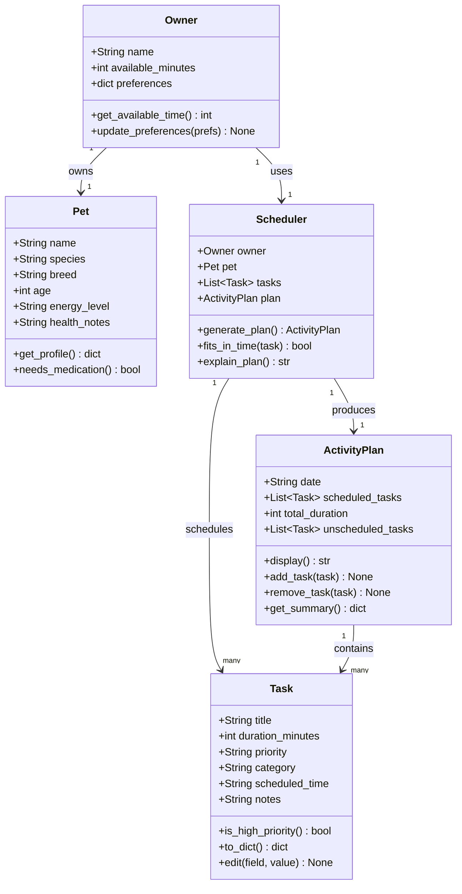

# PawPal+ Project Reflection

## 1. System Design

**a. Initial design**

The initial design uses five classes organized around a clear separation of data and logic. Data about the people and tasks lives in `Owner`, `Pet`, and `Task`. The scheduling logic lives entirely in `Scheduler`. The output of that logic is captured in `ActivityPlan`.

- **`Owner`** — holds the human side of the system: the owner's name, how much time they have available in a day, and any personal preferences (e.g., prefers morning walks). It is the entry point for all user-provided constraints.

- **`Pet`** — holds the animal's profile: name, species, breed, age, energy level, and health notes. This information informs which tasks are appropriate and how urgently they need to happen.

- **`Task`** — represents a single care action (e.g., "Morning walk", "Administer medication"). Each task knows its own duration, priority level, category, and any relevant notes. It also holds a `scheduled_time` once the planner assigns it a slot.

- **`Scheduler`** — the brain of the system. It takes an `Owner`, a `Pet`, and a list of `Task` objects, then decides which tasks to include in the day's plan and in what order, based on available time and priority. It also produces a plain-language explanation of its decisions.

- **`ActivityPlan`** — the output object. It holds the final ordered list of scheduled tasks, a list of tasks that didn't fit, the total time used, and methods to display or summarize the plan. It can also accept manual additions or removals after generation.

**Core User Actions**

The three core actions a user can perform in PawPal+:

1. **Enter pet and owner information** — The user provides details about their pet (species, breed, age, energy level, health needs) and themselves (name, contact info, availability preferences). This data forms the foundation for all scheduling decisions.

2. **Generate an activity plan** — Based on the user's available time, task priorities, and owner preferences, the system automatically creates a personalized activity schedule for the pet. The scheduler balances constraints like duration, frequency, and priority to produce a realistic, optimized plan.

3. **Add or edit tasks** — The user can manually add new tasks (e.g., a vet appointment, a grooming session) or edit existing ones in the activity plan, giving them direct control to adjust, reprioritize, or customize what the scheduler produces.

**UML Class Diagram**

**b. Design changes**

Yes, two changes were made after reviewing the skeleton against the UML.

**Change 1: Moved `needs_medication()` from `Pet` to `Scheduler`**

In the original UML, `needs_medication()` was a method on `Pet`. During review it became clear that `Pet` holds no task data — it only knows the animal's profile (species, age, energy level, etc.). A method that checks whether any tasks are medical in nature has to look at the task list, which only `Scheduler` has access to. Placing the method on `Pet` would have required either giving `Pet` a copy of the tasks (creating unwanted coupling) or leaving it impossible to implement. Moving it to `Scheduler` keeps `Pet` as a pure data object and puts the logic where the data already lives.

**Change 2: Added `remaining_minutes` to `Scheduler`**

The original `Scheduler` had no way to track how much time had been consumed as tasks were added to the plan. `fits_in_time(task)` needs this value to decide whether a task can still be scheduled, but there was nowhere to read it from. `remaining_minutes` is initialized from `owner.available_minutes` in `__init__` and will be decremented inside `generate_plan()` each time a task is accepted. Without this, the scheduler would have no memory of what it had already committed to.

---

## 2. Scheduling Logic and Tradeoffs

**a. Constraints and priorities**

- What constraints does your scheduler consider (for example: time, priority, preferences)?
- How did you decide which constraints mattered most?

**b. Tradeoffs**

The scheduler uses a **greedy algorithm**: it iterates through tasks sorted by priority (and by shortest duration within the same priority tier) and accepts each task as long as it fits in the remaining time budget. Once accepted, a task is never reconsidered — there is no backtracking.

This means the scheduler can produce a suboptimal packing. For example, if a 25-minute "high" task fills the last slot and a 5-minute "high" task is next in line, the 5-minute task gets skipped — even though it would fit if the 25-minute task had been deferred. A true optimal solution would require evaluating all possible combinations (a knapsack-style approach), which grows exponentially with the number of tasks.

The greedy approach is a reasonable tradeoff here for two reasons. First, pet care tasks are not interchangeable commodities — "high" priority tasks like medication or feeding genuinely should be attempted before "low" priority ones, so strict priority ordering reflects real-world intent. Second, the task list for a typical pet owner is small (5–20 tasks), so the edge cases where greedy fails (large tasks blocking small ones of equal priority) can be handled manually by the owner using the add/edit UI rather than requiring the complexity of full combinatorial optimization.

---

## 3. AI Collaboration

**a. How you used AI**

- How did you use AI tools during this project (for example: design brainstorming, debugging, refactoring)?
- What kinds of prompts or questions were most helpful?

**b. Judgment and verification**

- Describe one moment where you did not accept an AI suggestion as-is.
- How did you evaluate or verify what the AI suggested?

---

## 4. Testing and Verification

**a. What you tested**

- What behaviors did you test?
- Why were these tests important?

**b. Confidence**

- How confident are you that your scheduler works correctly?
- What edge cases would you test next if you had more time?

---

## 5. Reflection

**a. What went well**

- What part of this project are you most satisfied with?

**b. What you would improve**

- If you had another iteration, what would you improve or redesign?

**c. Key takeaway**

- What is one important thing you learned about designing systems or working with AI on this project?
