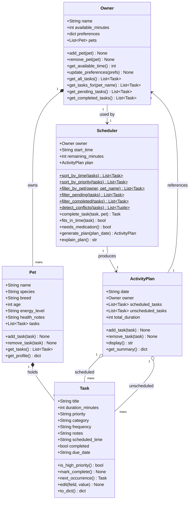

# PawPal+ — Final UML Class Diagram

> Export this as `uml_final.png` using one of:
> - [mermaid.live](https://mermaid.live) — paste the code block, click Download PNG
> - VS Code: install the **Mermaid Preview** extension, open this file, right-click → Export PNG
> - GitHub: this renders automatically in any `.md` file

